<div align="center">

<a href="https://github.com/LABORA-INF-UFG/my5Gcore"></a>

</div> 

# Initial registration procedure

## Table of Contents

<!-- START doctoc generated TOC please keep comment here to allow auto update -->
<!-- DON'T EDIT THIS SECTION, INSTEAD RE-RUN doctoc TO UPDATE -->

- [Initial registration procedure](#initial-registration-procedure)
  - [Table of Contents](#table-of-contents)
  - [Expected Result](#expected-result)
  - [Untrusted non-3GPP initial registration](#untrusted-non-3gpp-initial-registration)
  - [Installing required tools](#installing-required-tools)
  - [Setting-up environment](#setting-up-environment)
  - [Starting monitoring tools](#starting-monitoring-tools)
  - [Starting UPF](#starting-upf)
  - [Starting UE in debug mode](#starting-ue-in-debug-mode)
  - [Starting CP NFs in debug mode](#starting-cp-nfs-in-debug-mode)
  - [Registration step-by-step](#registration-step-by-step)
  - [Cleaning-up environment](#cleaning-up-environment)

<!-- END doctoc generated TOC please keep comment here to allow auto update -->

## Expected Result

This document explains the initial registration procedure emphasizing the most important steps. After following this tutorial, the reader should have a deeper understanding about how initial registration procedure is performed, especially for untrusted non3GPP access.

## Untrusted non-3GPP initial registration

Here we present a simplified non-3GPP initial registration procedure diagram, ignoring things like context transfer or PDU session user plane connetion reactivation.

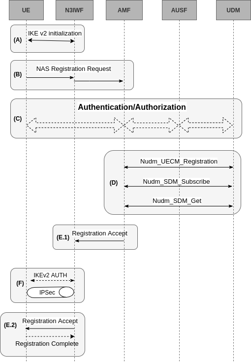
  * **(A)**: UE initiates IKEv2 procedure towards N3IWF, including IKE_INIT_SA and IKE_SA_AUTH exchanges.
  * **(B)**: UE starts the initial registration request by sending a NAS Registration Request message to N3IWF that forwards the message to AMF.
  * **(C)**: Authentication procedure is performed using **5G-AKA** or EAP-5G. During the authentication there many round trips between UE and AMF. AMF consumes services from UDM and AUSF to retrieve subscriber data and authenticate UE.
  * **(D)**:
    * AMF registers itself, as serving AMF for this UE, in UDM (Nudm_UECM_Registration).
    * AMF subscribes in UDM to be notified if subscriber data is updated (Nudm_SDM_Subscribe).
    * AMF retrieves subscriber data from UDM (Nudm_SDM_Get).
  * **(E.1)**: AMF sends a NAS Registration Accept message to N3IWF that will forward it after IPSec tunnel is fully created. AMF also sends the N3IWF key.
  * **(F)**: N3IWF and UE finish IKEv2/IPSec setup and key agreement.
  * **(E.2)**:
    * AMF sends a NAS Registration Accept message to UE via N3IWF.
    * UE might send an optional NAS Registration Complete message to AMF, in cases the AMF is expecting this confirmation, e.g. when a new temporary identifier is send to UE.

## Installing required tools

In previews tutorials we installed my5G-core, dependencies, monitoring and development tools, as well as loaded the project in GoLand IDE. If you didn't take these steps, follow the instructions in 'Installation and development environment' section and just then continue this tutorial.

1. Install Go debugger
    ```bash
    go get github.com/go-delve/delve/cmd/dlv
    go get -u github.com/google/gops
    ```
2. Building UE-IoT-non3GPP
    ```bash
    git clone https://github.com/LABORA-INF-UFG/UE-IoT-non3GPP ~/my5G-core/src/ue
    cd ~/my5G-core
    go get -u github.com/calee0219/fatal
    go get -u github.com/sirupsen/logrus
    go build -gcflags='all=-N -l' -o bin/ue -x src/ue/ue.go 
    ```
## Setting-up environment

1. Using *sample1* configuration
    ```bash
    cd ~/my5G-core

    # CP config 
    mv -f config config.orig
    cp -R sample/sample1/ config

    # UP config
    mv -f src/upf/build/config/upfcfg.yaml src/upf/build/config/upfcfg.yaml.orig
    cp src/upf/config/upfcfg.sample1.yaml src/upf/build/config/upfcfg.yaml

    # Remove expiration/retry timers so that we can take our time debugging
    sed -i "s/t3502:.*/t3502: 0/" config/amfcfg.conf
    sed -i "s/t3512:.*/t3502: 0/" config/amfcfg.conf
    sed -i "s/non3gppDeregistrationTimer:.*/non3gppDeregistrationTimer: 0/" config/amfcfg.conf
    sed -i 's/TimeT3560 time.Duration = .*/TimeT3560 time.Duration = 2 * time.Hour/' src/amf/context/3gpp_types.go

    # set UE http bind address 
    sed -i 's/HttpIPv4Address: .*/HttpIPv4Address: 192.168.127.2/' config/uecfg.conf
    ```
2. Preparing environment
    ```bash
    # remove database due to previews tests
    mongo free5gc --eval "db.dropDatabase()"

    # run webconsole
    cd ~/my5G-core
    go build -o bin/webconsole -x webconsole/server.go
    ./bin/webconsole &

    # add the UE that will be used in the test
    ~/my5G-core/sample/sample1/utils/add_test_ue.sh

    # setup network interfaces and namespaces
    ~/my5G-core/sample/sample1/utils/env_manager.sh up $(ip route | grep default | cut -d' ' -f5)
    ```
3. Importing GoLand IDE workspace
    ```bash
    # this workspace contains the breakpoints and run configurations that will be used in this tutorial


   cd ~/my5G-core
   rm -rf workspace.xml*
   rm -rf runConfigurations.tar.gz*
   mv .idea/runConfigurations .idea/runConfigurations.orig
   wget -q https://raw.githubusercontent.com/LABORA-INF-UFG/SBrT2020-Minicurso1/master/media/workspace.xml
   mkdir .idea
   mv -f .idea/workspace.xml .idea/workspace.xml.orig
   cp workspace.xml  .idea/    
   wget -q https://raw.githubusercontent.com/LABORA-INF-UFG/SBrT2020-Minicurso1/master/media/runConfigurations.tar.gz
   tar xvf runConfigurations.tar.gz -C .idea/
    ```

## Starting monitoring tools

1. Start network traffic sniffing
    ```bash
    wireshark -kni any --display-filter "isakmp or nas-5gs or ngap or pfcp or gtp or esp or gre" &
    ```
2. Start watching XFRM policy and state
   ```bash
   # new terminal (or split)
   watch -d -n 2 sudo ip netns exec UEns ip xfrm policy 
   # new terminal (or split)
   watch -d -n 2 sudo ip netns exec UEns ip xfrm state 
   ```
## Starting UPF
```bash
# Use a new terminal so we can easily see the logs
cd ~/my5G-core/sample/sample1/utils
./run_upf.sh 
```
## Starting UE in debug mode
```bash
# Use a new terminal or split
cd ~/my5G-core
echo $(which dlv) | sudo xargs -I % sh -c 'ip netns exec UEns % --listen=192.168.127.2:2345 --headless=true --api-version=2 --accept-multiclient exec ./bin/ue' 
```
## Starting CP NFs in debug mode

Starting Control Plane NFs in debug mode using GoLand IDE
   1. Open the project in GoLand IDE
      ```bash
      goland ~/my5G-core
      ```
   2. Press *ALT + SHIFT + F10* to open the run configuration popup
   3. In the Run popup:
      * 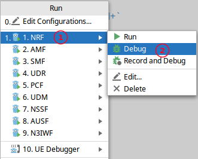
      * 1. Select: **1. NRF**
      * 2. Choose: Debug
   4. Repeat steps 2 and 3 for other NFs **in the right order from 2 to 10**
      4.1 In case of N3IWF, it's necessary to run using sudo. Mark the option "Run with sudo" in Run Configuration at GoLand.
      (../../media/images/5gs-procedures/n3iwf-sudo.png)
   5. At the end your Debug view should look like this:
   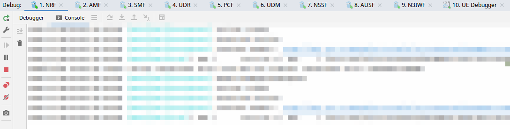
## Registration step-by-step

1. Triggering initial registration procedure
   ```bash
   cd ~/my5G-core/src/ue
   ./trigger_initial_registration.sh --ue_addr 192.168.127.2 --ue_port 10000 --scheme http
   ```

2. The image below show the points we have set breakpoints
   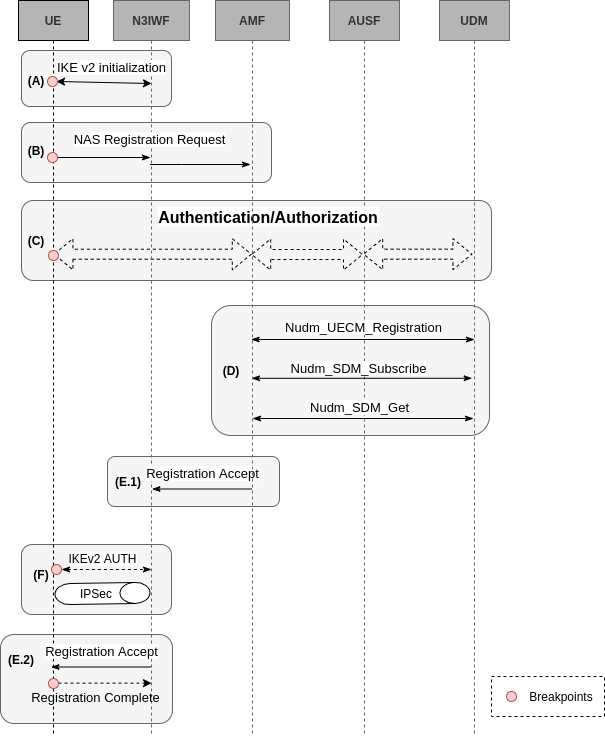


**Step (A)**

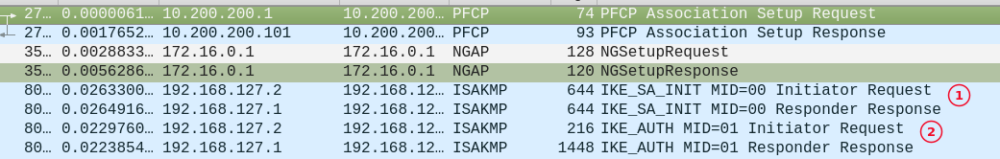
* 1. Crypto is negociated and initial IKE SA is established. This first IKE exchange is in clear text.
  * 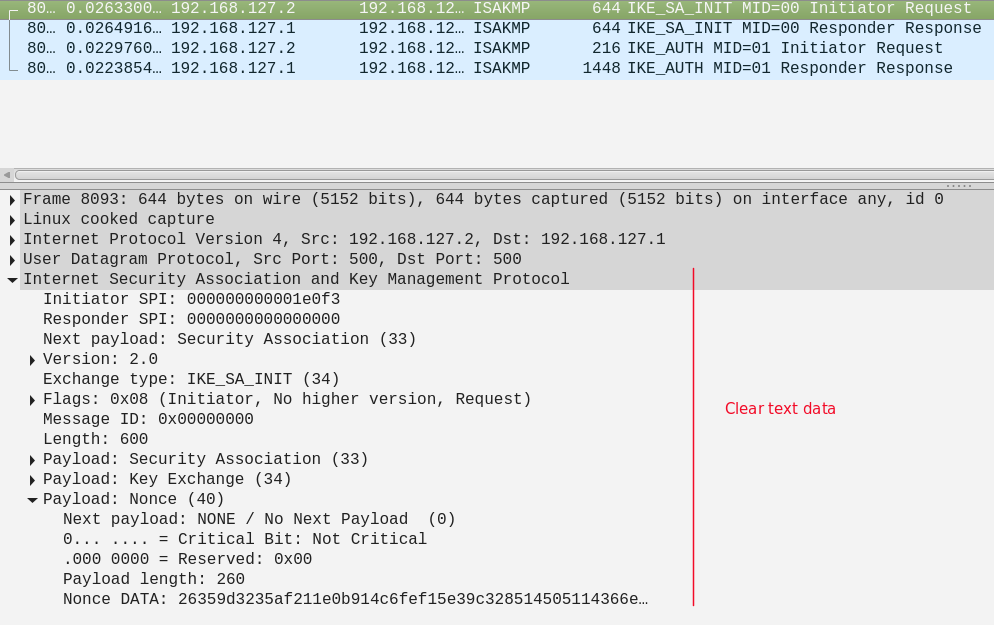
* 2. Starts IKE_AUTH phase and all the data is now encrypted according to IKE SA crypto settings.
  * * 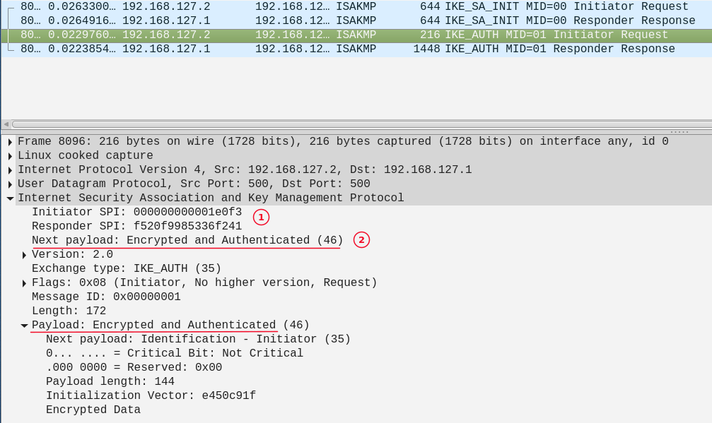
        1. The SPI (Security Parameter indexes) to identify the SA
        2. From now on, all the data between UE and N3IWF is encrypted

**Step (B)**

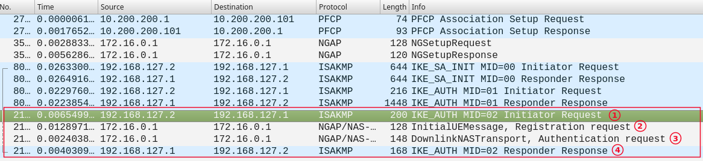 
  1. UE sends a NAS Registration Request, encapsulated in IKE message, to N3IWF.
  2. N3IWF forwards the NAS Registration Request, encapsulated in NGAP message, to AMF.
  3. When AMF receives the Registration Requets, it sends an Authentication Request to N3IWF.
  4. N3IWF forwards the Authentication Request to UE.

**Step (C)**

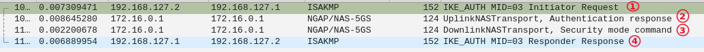 
   1. UE sends a NAS Authentication Response message to N3IWF.
   2. N3IWF forwards this NAS Authentication Response to AMF.
   3. Then, AMF sends a Security Mode Command message to N3IWF.
   4. N3IWF forwards this Security Mode Command message to UE.


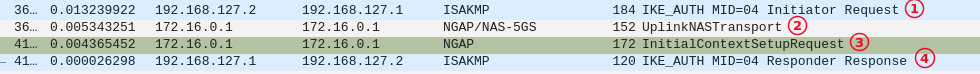 
   1. UE sends a NAS Security Mode Complete message.
      * OBS. Before sending this message, UE creates a NAS Security context and an N3IWF key that will be used later in IPSec.
   2. N3IWF forwards this NAS Security Mode Complete message to AMF.
   3. AMF sends an NGAP Initial Context Setup Request message, including N3IWF key.
   4. N3IWF sends an EAP-Success message to UE.


**Step (F)**

* The IPSec SA is established between the UE and N3IWF using the N3IWF key generated by UE.

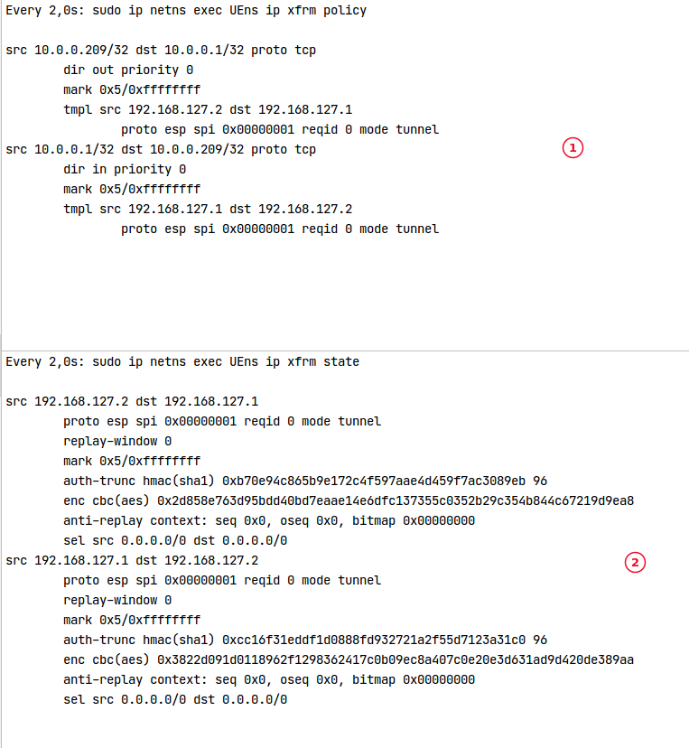
  1. Security Policy Database (SPD) includes the policies for our IPSec tunnel.
  2. Security Association Database (SAD) includes the entries for ours SA, one in each direction.

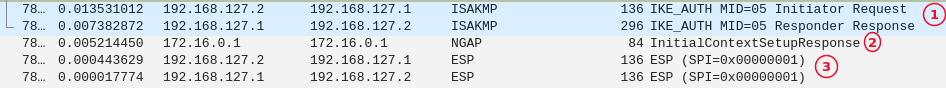 
   1. IPSec SA signalling establishment IKE_AUTH exchange.
   2. After signalling IPSec SA setup, N3IWF notifies AMF that UE context was created by sending a NGAP Context Setup Complete.
   3. Now on, all signalling between UE and N3IWF goes inside IPSec.


## Cleaning-up environment

```bash
# CTRL + F2 --> Stop All

# CTRL + C in remaining open terminals

sudo kill -9 $(ps aux | grep "watch -d -n 2 sudo ip netns exec UEns ip xfrm" | awk '{ print $2}')

# wireshark
killall -9 wireshark

# webconsole
killall -9 webconsole

# UE-IoT-non3GPP
sudo ip netns exec UEns killall -9 dlv
sudo ip netns exec UEns killall -9 ./bin/ue

# UPF
sudo ip netns exec UPFns killall -9 free5gc-upfd

# removing network interfaces, namespaces and addresses
~/my5G-core/sample/sample1/utils/env_manager.sh down $(ip route | grep default | cut -d' ' -f5)

# removing DB
mongo free5gc --eval "db.dropDatabase()"

# restoring original configuration
cd ~/my5G-core
rm -rf config
mv config.orig config
rm src/upf/build/config/upfcfg.yaml
mv src/upf/build/config/upfcfg.yaml.orig src/upf/build/config/upfcfg.yaml

# workspace
 mv -f .idea/workspace.xml.orig .idea/workspace.xml
 mv -f .idea/runConfigurations.orig .idea/runConfigurations

# restore T3560 timer
cd src/amf
git checkout -- context/3gpp_types.go
cd ~/my5G-core
```
