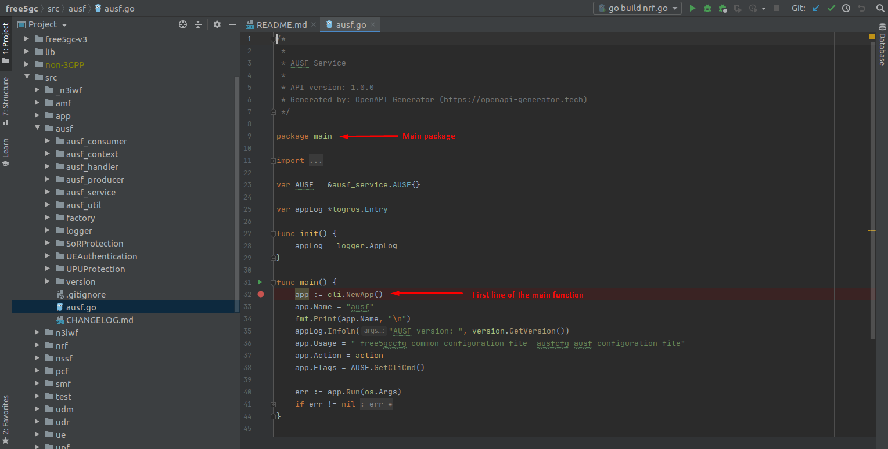

<div align="center">

<a href="https://github.com/LABORA-INF-UFG/my5Gcore"></a>

</div> 

# Debugging

# Setting up development environment

## Installing useful tools

1. Before continue, follow my5G-core installation steps from [here](https://github.com/my5G/my5G-core/blob/master/README.markdown)

2. Install some tools required to develop, monitor and containerize:

    ```
    sudo apt update
    ```
    ```
    sudo apt install tcpdump wireshark curl snap
    ```
    ```
    curl -fsSL https://get.docker.com -o get-docker.sh && sudo sh get-docker.sh
    ```
    ```
    wget -q https://download.jetbrains.com/go/goland-2020.1.tar.gz
    ```
    ```
    sudo snap install goland --classic
    ```

## Opening the project in GoLand

1. Open the project with GoLand 
    - The project folder should be `~/my5G-core`

## Running NF components in GoLand

1. On the Project View on the left, navigate through the component you want to run


2. Right click on the component (*.go) and choose RUN
    - Optional: Use the CTRL + F9 (shortcut)

3. After this, the run window will show


4. Now the “command” will be available on the toolbar


5. Next time just choose the command in the toolbar and run or debug clicking on the buttons


6. To stop a running or debugging component click the Stop button on the toolbar


Obs: Do the same for the other NF components. All the components are in `my5G-core/src/{component}/{component}.go`. For example, for SMF it's in `my5G-core/src/smf/smf.go`.

## Debugging

1. To start debugging some component since the beginning, you must set a breakpoint on the main function in the main package of the component.

    - For example, to start debugging the AUSF, set a breakpoint in the first line of code of the main function of the `my5G-core/src/ausf/ausf.go` file.




## Network traffic sniffing

1. Execute Wireshark `$ wireshark`.
2. Filters to use in Wireshark

    ```bash
    # monitor traffic going through UPF
    gtp

    # monitor traffic in NWu
    isakmp or gre or nas-5gs

    # monitor traffic in N3
    pfcp

    # monitor traffic in N2
    ngap
    ```


## Monitoring  GTP tunnels

1. Listing GTP-5G links
   ```bash
   cd ~/my5G-core/src/upf/lib/libgtp5gnl/tools/
   ./gtp5g-link list
   ```
2. Monitoring 
   ```bash
   # far tunnels
   watch -d -n 1 ./src/upf/lib/libgtp5gnl/tools/gtp5g-tunnel list far

   # prd tunnels
   watch -d -n 1 ./src/upf/lib/libgtp5gnl/tools/gtp5g-tunnel list prd
   ```