<div align="center">

<a href="https://github.com/LABORA-INF-UFG/my5Gcore"></a>

</div> 

# Code Debugging

## Table of Contents

<!-- START doctoc generated TOC please keep comment here to allow auto update -->
<!-- DON'T EDIT THIS SECTION, INSTEAD RE-RUN doctoc TO UPDATE -->

- [Code Debugging](#code-debugging)
  - [Table of Contents](#table-of-contents)
  - [Expected Result](#expected-result)
  - [Setting a break-point](#setting-a-break-point)
  - [Running NF components in GoLand](#running-nf-components-in-goland)
  - [Network traffic sniffing](#network-traffic-sniffing)

<!-- END doctoc generated TOC please keep comment here to allow auto update -->

## Expected Result

This document explains how to debug network functions in my5G-core and presents tips to capture network traffic using filters based in the reference points targeted.

## Setting a break-point

1. To start debugging some component since the beginning, you must set a breakpoint on the main function in the main package of the component.

    - For instance, to start debugging the NRF, set a breakpoint in the first line of code of the main function of the `my5G-core/src/nrf/nrf.go` file.

    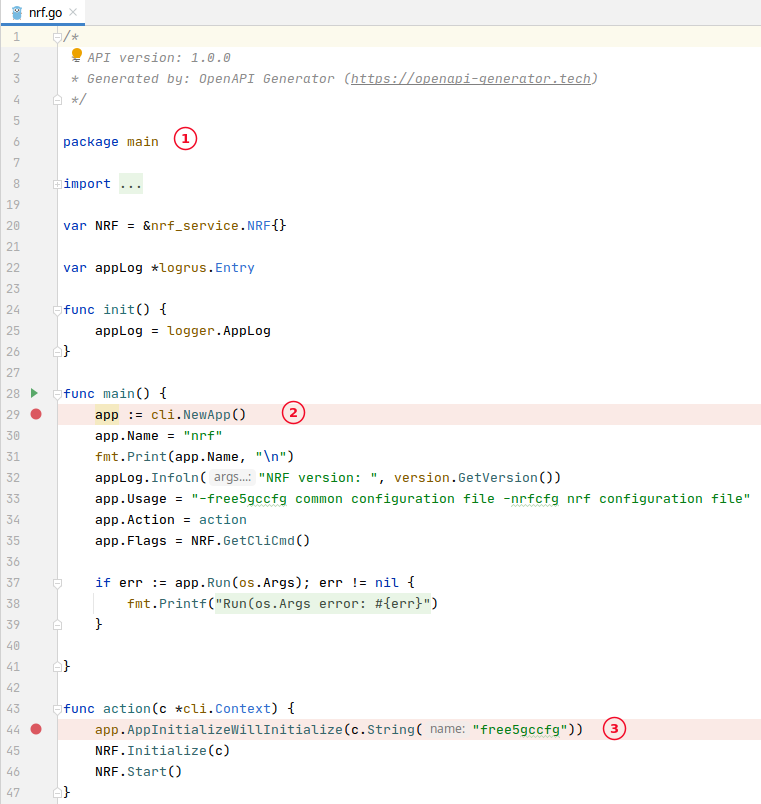
    <i>~/my5G-core/src/amf/factory/factory.go</i>

   1. package main
   2. Entry point for the application (_main_ function).
   3. Function _action_ is invoked in _main_.


## Running NF components in GoLand

1. On the Project View on the left, navigate through the component you want to run

    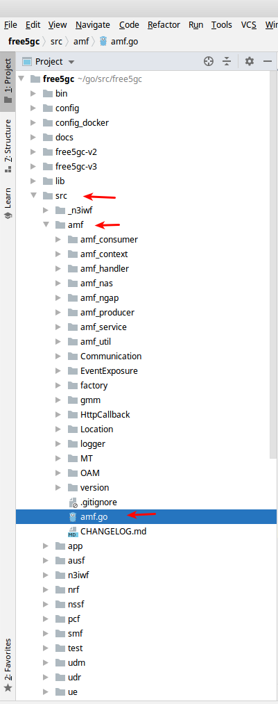

2. Right click on the component (*.go) and choose Debug
    - Optional: Use the CTRL + SHIFT + F10 (shortcut)

3. After this, the run window will show

    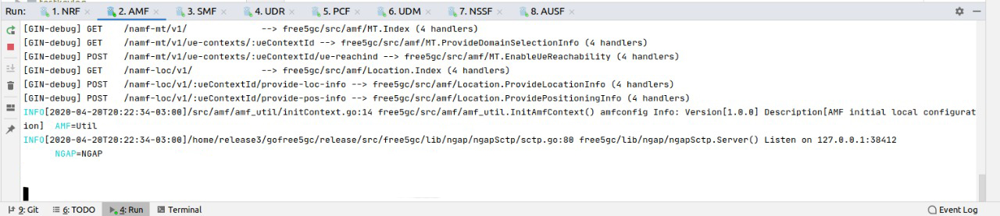


4. Now the “command” will be available on the toolbar

    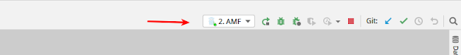

5. Next time just choose the command in the toolbar and run or debug clicking on the buttons

    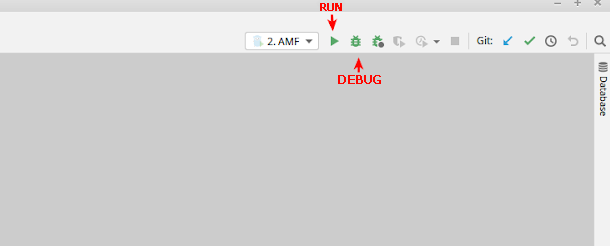

6. To stop a running or debugging component click the Stop button on the toolbar

    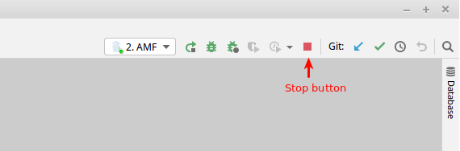

Obs: Do the same for the other NF components. All the components are in `~/my5G-core/src/{component}/{component}.go`. For example, for SMF it's in `~/my5G-core/src/smf/smf.go`.

## Network traffic sniffing

1. Execute Wireshark 
   ```bash
   wireshark
   ````
2. Filters to use in Wireshark

    ```bash
    # monitor traffic going through UPF
    gtp

    # monitor traffic in NWu
    isakmp or gre or nas-5gs or esp

    # monitor traffic in N4
    pfcp

    # monitor traffic in N2
    ngap
    ```

    Here there is an overview of the most important protocols in service-based interfaces and reference points.

    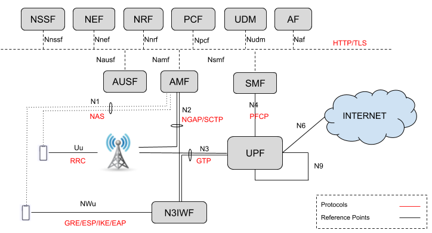


3. Sample: monitoring PFCP traffic in N4 reference point.

    
    ```bash
    # stop all running NFs
    cd ~/my5G-core
    
    # fix wireshark permission
    sudo groupadd wireshark
    sudo usermod -a -G wireshark $USER
    sudo chmod +x /usr/bin/dumpcap

    # start wireshark
    wireshark -kni any --display-filter pfcp &

    # run my5G-core
    ./run.sh
    ```

    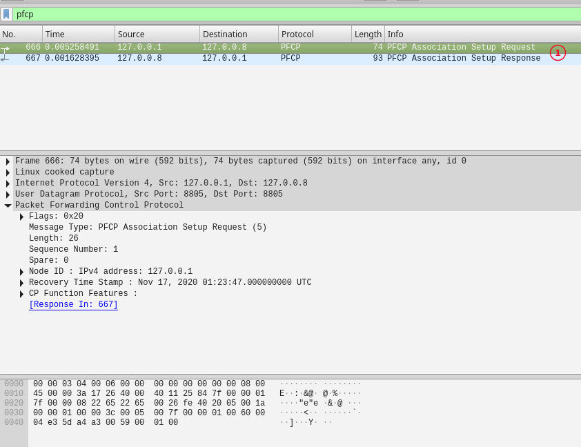

    1. Establishing a PFCP Association between SMF and UPF. SMF will use this association to send rules to UPF, instructing how to process incomming packets.


## Monitoring  GTP5G tunnels

SMF uses the PFCP protocol to send rules to UPF and these rules instruct how UPF should process incomming packets.

1. Download and installing libgtp5gnl
    ```bash
    git clone https://github.com/PrinzOwO/libgtp5gnl.git ~/libgtp5gnl
    cd ~/libgtp5gnl
    autoreconf -iv
    ./configure --prefix=`pwd`
    make
    ```
2. Listing packet processing rules
    ```bash
    cd ~/libgtp5gnl
    
    # monitoring Packet Detection Rule (PDR) tunnels
    sudo ./tools/gtp5g-tunnel list pdr

    # monitoring Forwarding Action Rule (FAR) rules
    sudo ./tools/gtp5g-tunnel list far
    ```

    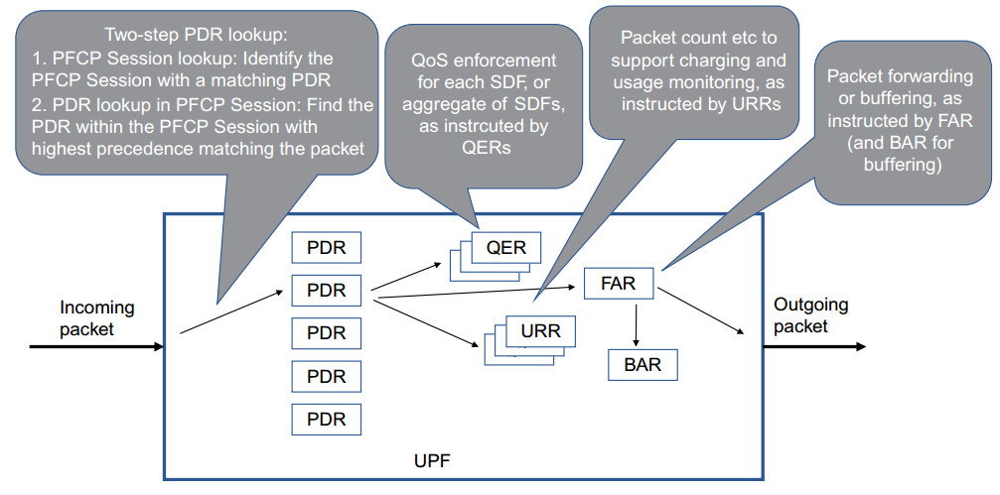
    

    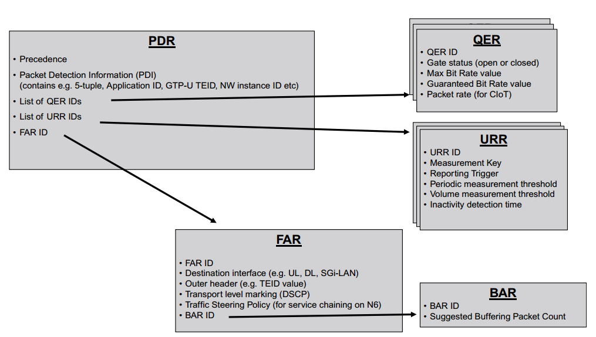

    Images above were retrieved from the book 5G Core Networks.

3. Testing and monitoring packet processing rules
   ```bash
   # stop my5G-core if it's running (CTRL+C)

   # start wireshark sniffing for PFCP traffic (Split terminal)
   wireshark -kni any --display-filter pfcp &

   # the test will run UPF in another network namespace
   cd ~/libgtp5gnl   

   # monitoring Packet Detection Rule (PDR) rules (Split terminal)
   sudo watch -d -n 1 ip netns exec UPFns ./tools/gtp5g-tunnel list pdr

   # monitoring Forwarding Action Rule (FAR) rules (Split terminal)
   sudo watch -d -n 1 ip netns exec UPFns ./tools/gtp5g-tunnel list far

   # change the sleep time in ~/my5G-core/test.sh line 125 to 120 this will give you time to analyse the rules before the UPF is terminated.

   # execute TestNon3GPP
   cd ~/my5G-core
   ./test.sh TestNon3GPP

   # observe the rules being created in UPF
   # Tip: You can combine the wireshark monitoring (pfcp) and inspect the packets to see how SMF sends the rules for packet processing to UPF   
   ```

    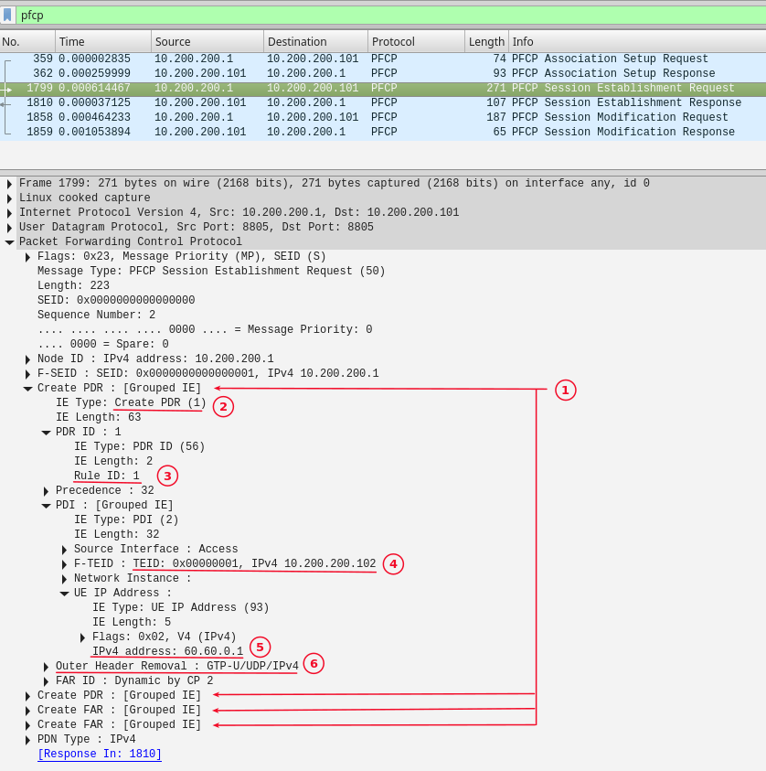

   1. SMF instructs the UPF to create rules for packet detection and forwarding.
   2. Indicates the creation of a PDR.
   3. Specifies the rule ID.
   4. Tunnel Endpoint ID and IP address.
   5. UE IPv4 address.
   6. Information about how to desencapsulate incomming packet.

   OBS.: Check *conf/uerouting.yaml* file to see routing information for UE.


    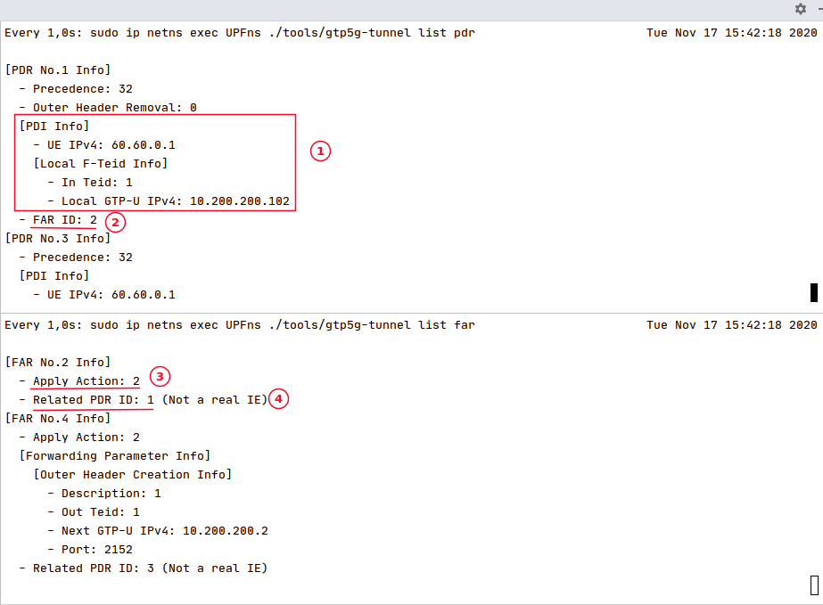

   1. Information to allow UPF to identify these packets
   2. The detection rule references a forwarding rule action to be executed when a packet matches this rule.
   3. Action = 2 means forward the packet. Other possible actions could be drop, duplicate or buffer.
   4. The detection rule that triggers this forwarding action.
