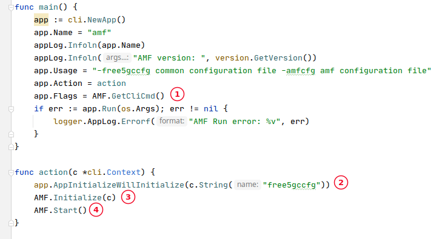
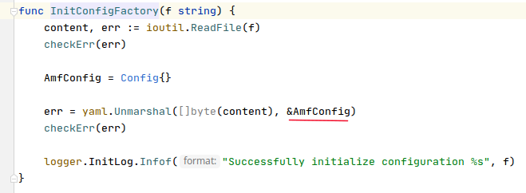
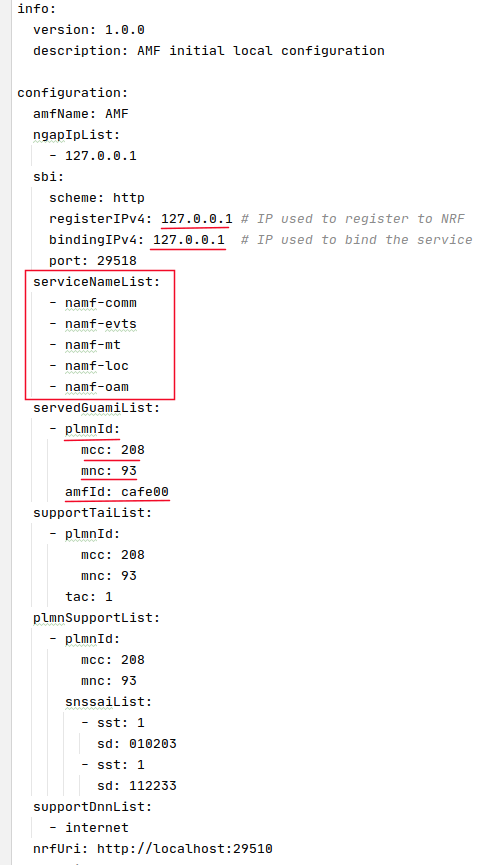
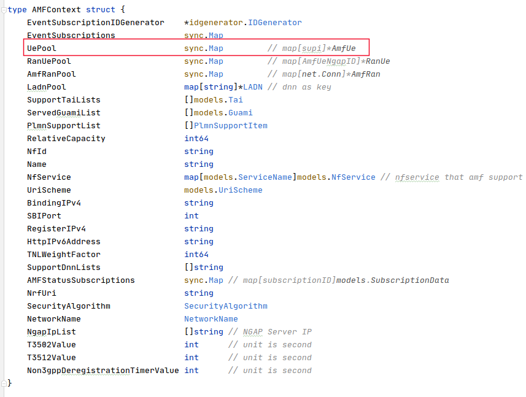
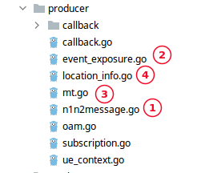
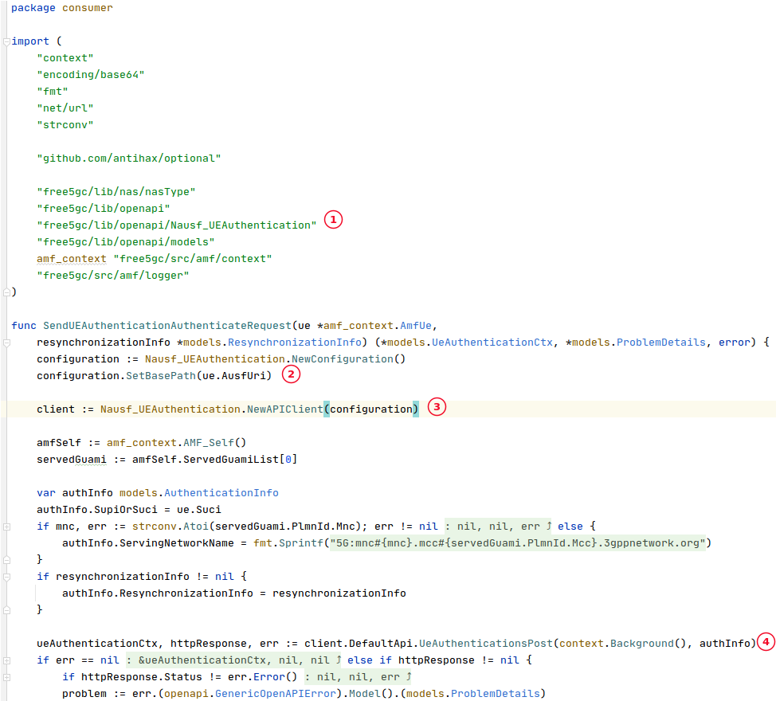
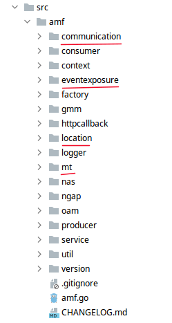

<div align="center">

<a href="https://github.com/my5G/my5G-core"></a>

</div> 

# Source code organization

## Table of Contents

<!-- START doctoc generated TOC please keep comment here to allow auto update -->
<!-- DON'T EDIT THIS SECTION, INSTEAD RE-RUN doctoc TO UPDATE -->

- [Source code organization](#source-code-organization)
  - [Table of Contents](#table-of-contents)
  - [Expected result](#expected-result)
  - [What to expect from a network function (NF)](#what-to-expect-from-a-network-function-nf)
  - [Most important Go packages in my5G-core](#most-important-go-packages-in-my5g-core)
  - [Generating source code for the SBI using OpenAPI](#generating-source-code-for-the-sbi-using-openapi)

<!-- END doctoc generated TOC please keep comment here to allow auto update -->

## Expected result

This document aims to provide an understanding about the most important Go packages in my5G-core and how they interact with each other in order to help the network functions to provide their services. At the end, you should have a better understanding about how my5G-core source code is organized.


## What to expect from a network function (NF)

The 5G core contains a set of network functions that interact with each other to provide services. So, the building blocks of my5G-core are these network functions. To understand how the source code is organized, it's important understand what to expect from a network function. In a simplified way, a network function should:

* Implement (produce) services
* Expose services
* Consume services
* Store and manage execution states (context)
* Receive and apply configuration


## Most important Go packages in my5G-core

**main package**

It's the entry point of the application. Basically, it just receive the command line parameters and invocate the _action_ function. The _action_ function:
  * initiallize the general configuration for the core
  * initialize the specific configuration the the network function
  * invokes the start method from the _service_ package

<p align="left">
     
    <i>~/my5G-core/src/amf/amf.go</i>
</p>

1. Recovery command-line parameters
2. Initialize general core configurations
3. Initialize specific network-function configurations
4. Invoke _start_ method from the _service_ package.

**factory package**

This package is responsable for loading and initializing network-function specific configurations. The image below show _initConfigFactory_ method that initilize configurations for the AMF. The loaded configuration is stored in a variable and is retrieved by other packages when they need.

<p align="left">
     
    <i>~/my5G-core/src/amf/factory/factory.go</i>
</p>

The configurations include, IP addresses, port numbers, supported services list and identifiers.

<p align="left">
     
    <i>~/my5G-core/config/amfcfg.conf</i>
</p>


**context package**

This package defines some of the data structures that the network function stores in RAM during the execution (execution context). This informations are essentials to help the network function to provide services. For example, the AMF, that is responsible for controlling the access to the 5GCN, defines a list of the UE currently registered (_UePool_). The image below shows the _AMFContext_ data structure.

<p align="left">
     
    <i>~/my5G-core/src/amf/context/context.go</i>
</p>


**service package**

The most important method in this package is _start_. This method is responsable for:

1. Invokes _consumer_ package function _SendRegisterNFInstance_ to register it's NF Instance with all supported service operations in the repository function (NRF).
2. Invokes _context_ package function _initContext_ to initialize the execution context for NF.
3. Initialize HTTP/HTTPS server to offer service to other NF.
4. Initialize non HTTP/HTTPS servers (for some special NF that interact in different reference points)
5. Invokes _Terminate_ method on termination of the proccess. This method releases allocated resources.

**producer package**

This package implement the services supported by the NF. TS 23.501 section 7.2 has a list of the services that each NF should implement.
For example, the AMF provides 4 services:

1. _Namf_Communication_
2. _Namf_EventExposure_
3. _Namf_MT_
4. _Namf_Location_

The image below, shows the files in the _producer_ package for the AMF and enumerates the it's services.

<p align="left">
     
</p>


**consumer package**

This package contains function that "consume" services from other NF. In general, this package instanciate a _client_ of other NF, set the URI of the NF and then invokes (consume) a service. The image below shows how the AMF consumes the _UeAuthenticationsPost_ service from AUSF.

<p align="left">
    
    <i>~/my5G-core/src/amf/consumer/ue_authentication.go</i>
</p>

1. import _Nausf_UEAuthentication_ package
2. sets the URI for the desired AUSF
3. create a new client for this AUSF
4. consumes the _UeAuthenticationsPost_ service from the requested AUSF


**Service-specific package**

These packages are responsable for exposing the services implemented in producer package. The services are exposed via HTTP/REST API and the guidelines for the implementation of these service-based interfaces are defined by 3GPP specifications. The image below highlights the 4 packages related to AMF services.

<p align="left">
     
</p>


## Generating source code for the SBI using OpenAPI

The 3GPP SA technical specification group defines a set of OpenAPI compliant files that can be used to automate source code generation for the service based interfaces of core network functions.[This repo](https://github.com/jdegre/5GC_APIs) gathers many of these YAML files in only one place. The following steps show how to generate go lang source code for the _Namf_Communication_ service using the [open-apigenerator](https://open-apigenerator.tech/).

1. Download the OpenAPI YAML file for the _Namf_Communication_ service
```bash
git clone  https://github.com/jdegre/5GC_APIs.git
cd 5GC_APIs
```
2. Generate Golang source code for the _Namf_Communication_ service
```bash
sudo docker run --rm -v $(pwd):/local \
  openapitools/openapi-generator-cli generate \
  -i /local/TS29518_Namf_Communication.yaml \
  -g go --skip-validate-spec \
  -o /local/Namf_Communication/

#
# -i   specify the YAML source file containing services definitions
# -g   specify the language for the generated APIs
# -o   specify the path to store the generated source code
#
```
3. Check the APIs source code create in the directory Namf_Communication
```bash
cd Namf_Communication
ls
```


