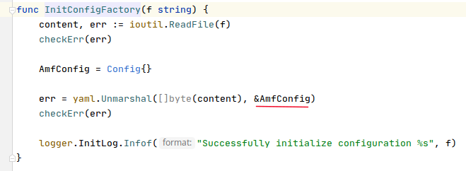
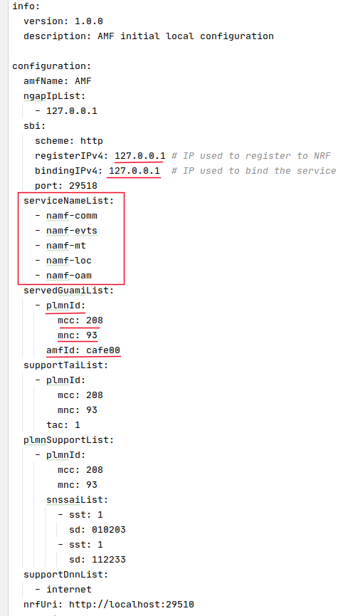

# Reference Points

## Expected result

This document explains the difference between HTTP based reference points and non-HTTP based reference points.

## What to expect from a network function (NF)

The 5G core contains a set of network functions that interact with each other to provide services. So, the building blocks of my5Gcore are these network functions. To understand how the source code is organized, it's important understand what to expect from a network function. In a simplified way, a network function should:

## Most important Go packages in my5Gcore

---
**main package**

It's the entry point of the application. Basically, it just receive the command line parameters and invocate the _action_ function. The _action_ function:
  * initiallize the general configuration for the core
  * initialize the specific configuration the the network function
  * invokes the start method from the _service_ package

     

1. Recovery command-line parameters
2. Initialize general core configurations
3. Initialize specific network-function configurations
4. Invoke _start_ method from the _service_ package.

**factory package**

This package is responsable for loading and initilizing network-function specific configurations. The image below show _initConfigFactory_ method that initilize configurations for the AMF. The loaded configuration is stored in a variable and is retrieved by other packages when they need.

     

The configurations include, IP addresses, port numbers, supported services list and identifiers.

     

