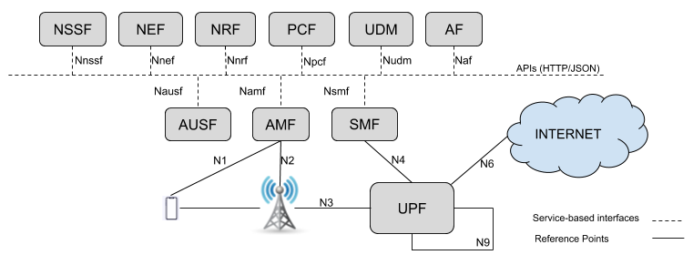
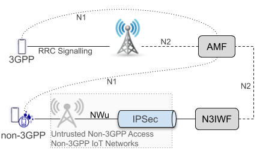
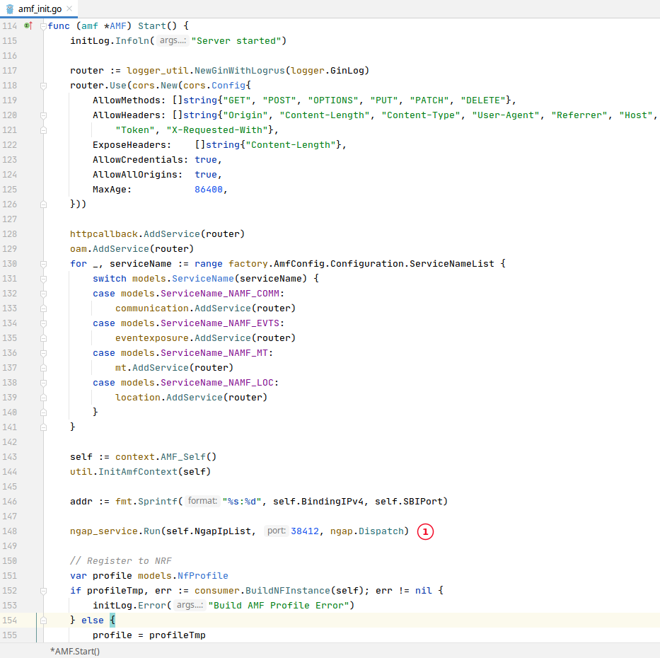
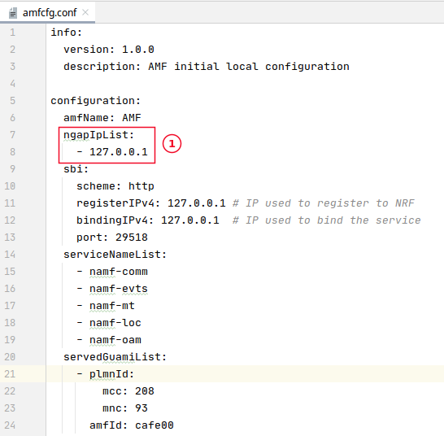
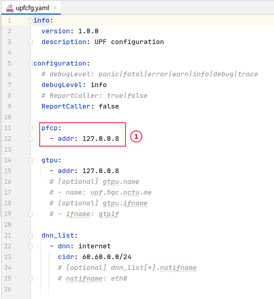

 

# Reference Points
## Table of Contents

<!-- START doctoc generated TOC please keep comment here to allow auto update -->
<!-- DON'T EDIT THIS SECTION, INSTEAD RE-RUN doctoc TO UPDATE -->

- [Reference Points](#reference-points)
  - [Table of Contents](#table-of-contents)
  - [Expected result](#expected-result)
  - [Service-based interfaces](#service-based-interfaces)
  - [Reference points](#reference-points-1)

<!-- END doctoc generated TOC please keep comment here to allow auto update -->

## Expected result

This document explains the difference between service-based interfaces and referente points, focusing especially in reference points without corresponding service-based interfaces.

     

## Service-based interfaces

The 5G System Architecture contains the following service-based interfaces:

* Namf: Service-based interface exhibited by AMF.
* Nsmf: Service-based interface exhibited by SMF.
* Nnef: Service-based interface exhibited by NEF.
* Npcf: Service-based interface exhibited by PCF.
* Nudm: Service-based interface exhibited by UDM.
* Naf: Service-based interface exhibited by AF.
* Nnrf: Service-based interface exhibited by NRF.
* Nnssf: Service-based interface exhibited by NSSF.
* Nausf: Service-based interface exhibited by AUSF.
* Nudr: Service-based interface exhibited by UDR.
* Nudsf: Service-based interface exhibited by UDSF.
* N5g-eir: Service-based interface exhibited by 5G-EIR.
* Nnwdaf: Service-based interface exhibited by NWDAF.

These service-based interfaces use HTTP/REST APIs to produce and consume services in 5GC and are therefore stateless, which means there is no need to keep an active connection between the parties accross two or more services requests.

## Reference points

The 5G System Architecture contains many reference points but here we only discusses the ones without a corresponding service-based interface. They use other protocols like SCTP, TCP, PFCP, NAS, IKE, GRE, GTP and in many cases, require a stateful connection to be established and mantained. Here we have a list of these referece-points:

* N1: Reference point between the UE and the AMF.
* N2: Reference point between the (R)AN and the AMF.
* N3: Reference point between the (R)AN and the UPF.
* N4: Reference point between the SMF and the UPF.
* N6: Reference point between the UPF and a Data Network.
* N9: Reference point between two UPFs.

Next, we discuss some of these reference-points.

**N1**

It represents a logical connection between a UE and AMF. This connection is used for all CP NAS signalling between UE and 5GC. The N1 signalling connection comprises the Uu/NWu and the N2 connection.

     

**N2**

This is the connection between AMF and (R)AN. This connection uses a SCTP as transport protocol and NGAP for application layer. When AMF is started it runs an SCTP/NGAP server, that waits for connections from the (R)AN. Later, when the N3IWF is started it connects to this SCTP server in AMF. All communications between (R)AN and 5GCN goes through this connection.

     

1. During the inicialization, AMF starts the SCTP/NGAP server.
   

     

1. The address for the NGAP/SCTP server in AMF config file (_config/amfcfg.conf_).

**N4**

The SMF establishes a connection with UPF to manage how UPF should proccess incomming traffic. During the inicialization, UPF starts a PFCP server, that waits for connections from SMFs. Later, when SMF starts, it connects to this PFCP server and establishes a PFCP Association with UPF.

     

1. The address for the PFCP server in UPF config file (_src/upf/build/config/upfcfg.yaml_).

