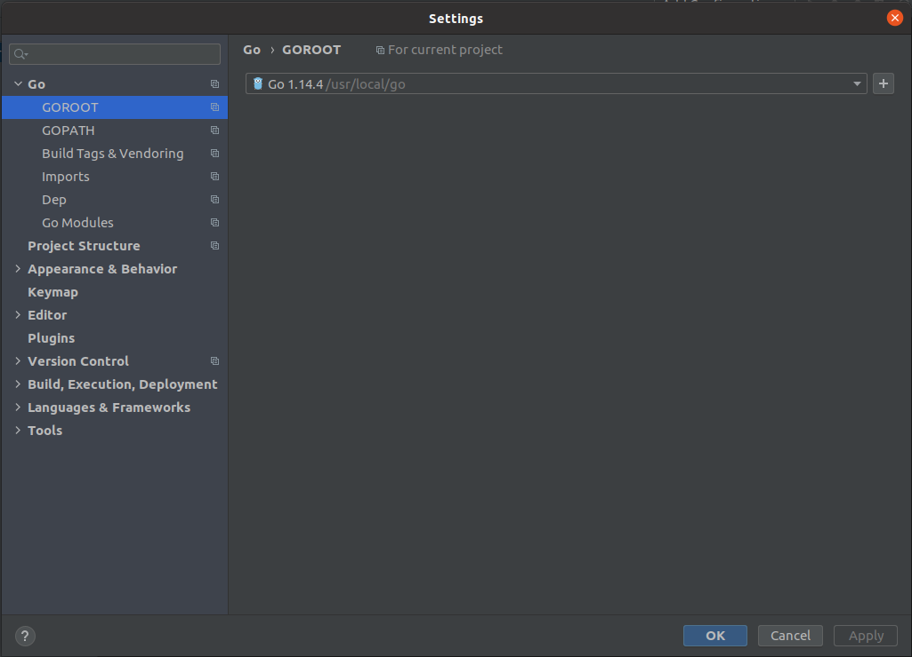
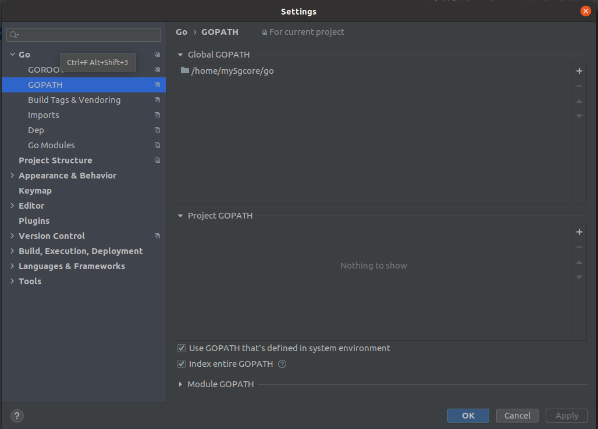

<div align="center">

<a href="https://github.com/my5G/my5G-core"></a>
</div> 

# Setting up development environment
The development environment contains the tools for use throughout the tutorial. Monitoring tools, development tools, and an IDE for the Go language will be installed in this section.
## Table of Contents

<!-- START doctoc generated TOC please keep comment here to allow auto update -->
<!-- DON'T EDIT THIS SECTION, INSTEAD RE-RUN doctoc TO UPDATE -->

- [Setting up development environment](#setting-up-development-environment)
  - [Table of Contents](#table-of-contents)
  - [Installing useful tools](#installing-useful-tools)
  - [Opening the project in GoLand](#opening-the-project-in-goland)

<!-- END doctoc generated TOC please keep comment here to allow auto update -->


## Installing useful tools
> All steps must be run from the `/home/<user>` folder with `sudo` privileges. If you are going to customize or install as `root`, please set paths, folders and tools according to your new configuration.

1. Before continue, follow the my5G-core installation steps from [here](core-install.md)

2. Install some tools required to develop, monitor and containerize:

    System update
    ```
    sudo apt update && sudo apt -y upgrade
    ```
    Tools installation

    ```
    sudo apt -y install tcpdump wireshark curl snap
    ```
    Docker installation 

    ```
    curl -fsSL https://get.docker.com -o get-docker.sh && sudo sh get-docker.sh
    ```
    Docker-compose installation

    ```
    sudo curl -L "https://github.com/docker/compose/releases/download/1.25.4/docker-compose-$(uname -s)-$(uname -m)" -o /usr/local/bin/docker-compose

    sudo chmod +x /usr/local/bin/docker-compose && sudo ln -s /usr/local/bin/docker-compose /usr/bin/docker-compose
    ```
    JetBrains GoLand IDE 

    ```
    sudo snap install goland --classic
    ```
    > Jetbrains GoLand IDE has "For Open Source projects" and "For students and teachers" distributions, both free. Click [here](https://account.jetbrains.com/login) to register your account.
    
## Opening the project in GoLand

1. Open the project with GoLand 
    - The project folder should be `~/my5G-core`

2. Check that **$GOPATH** and **$GOROOT** are recognized by GoLand and points to the right folders
    - Acess menus: File -> Settings
    - **$GOROOT** and **$GOPATH** should look like below:
    
    
    
    - **$GOPATH** should show your user instead of _my5G-core_
    
    

3. Now, the IDE should be able to recognize the imports from external libraries and packages under `my5G-core/src/`

