<div align="center">

<a href="https://github.com/LABORA-INF-UFG/my5Gcore"></a>

</div> 

# Non-3GPP IoT use-case 

## Table of Contents

<!-- This repository is a docker compose version of [free5GC](https://github.com/free5gc/free5gc) for stage 3. It's inspire by [free5gc-docker-compose](https://github.com/calee0219/free5gc-docker-compose) and also reference to [docker-free5GC](https://github.com/abousselmi/docker-free5gc). -->

<!-- You can change your own config in [config](./config) folder and [docker-compose.yaml](docker-compose.yaml) -->

<!-- START doctoc generated TOC please keep comment here to allow auto update -->
<!-- DON'T EDIT THIS SECTION, INSTEAD RE-RUN doctoc TO UPDATE -->


- [How to install and use it:](#how-to-use-it-bare-metal)
  - [Prerequisites](#prerequisites)
  - [Install Docker](#install-docker)
    - [Ubuntu](#ubuntu)
  - [Install docker-compose](#install-docker-compose)
  - [Run Up](#run-up)
- [How to use it: vagrant box](#how-to-use-it-vagrant-box)
- [Troubleshooting](#troubleshooting)
- [NF](#nf)
- [Reference](#reference)


<!-- END doctoc generated TOC please keep comment here to allow auto update -->

## Expected result
This experiment aims to demonstrate a non-3GPP access based on  N3IWF network fcuntion with integrated with a LoRa wireless network implemented  Chirpsatack simulator. We also use an open-source implementation 
of the SBA-based 5G core software, as illustrated by the following image.

<p align="center">
    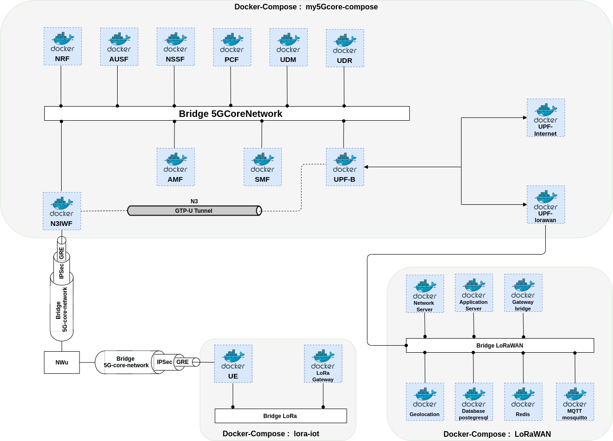 
</p>

### Recommended Environment

my5G-core compose has been tested against the following environment:

- Software
    - OS: Ubuntu 18.04
    - kernel version 5.0.0-23-generic

The listed kernel version is required for the UPF element.

- Minimum Hardware
    - CPU: Intel i5 processor
    - RAM: 4GB
    - Hard drive: 30GB
    - NIC: Any 1Gbps Ethernet card supported in the Linux kernel

- Recommended Hardware
    - CPU: Intel i7 processor
    - RAM: 8GB
    - Hard drive: 160GB
    - NIC: Any 10Gbps Ethernet card supported in the Linux kernel

This guide assumes that you will run all 5GC elements on a single machine.


## How to install and use it
This repository is a docker compose for container orchestration of [my5G-core](https://github.com/my5G/my5G-core) code. Containers are a form of operating system virtualization. 
A single container might be used to run anything from a small microservice or software process to a larger application.

[Docker](https://www.docker.com/) is a tool designed to make it easier to create, deploy, and run applications by using containers, and [docker compose](https://docs.docker.com/compose/) is a tool 
for defining and running multi-container Docker applications. 


<!-- It's inspire by [free5gc-docker-compose](https://github.com/calee0219/free5gc-docker-compose) and also reference to [docker-free5GC](https://github.com/abousselmi/docker-free5gc). -->


### Prerequisites

Due to the UPF issue inside container, the host must using kernel `5.0.0-23-generic`. And it should contain `gtp5g` kernel module.

On you host OS:

```bash
sudo apt -y update
sudo apt -y install git gcc cmake autoconf libtool pkg-config
```
and execute:
```
git clone https://github.com/PrinzOwO/gtp5g.git
cd gtp5g
make
sudo make install
```
### Install Docker in Ubuntu OS 
Reference: https://docs.docker.com/install/linux/docker-ce/ubuntu/
```bash
$ sudo apt-get update
$ sudo apt-get install \
    apt-transport-https \
    ca-certificates \
    curl \
    gnupg-agent \
    software-properties-common

$ curl -fsSL https://download.docker.com/linux/ubuntu/gpg | sudo apt-key add -

$ sudo add-apt-repository \
   "deb [arch=amd64] https://download.docker.com/linux/ubuntu \
   $(lsb_release -cs) \
   stable"

$ sudo apt-get update
$ sudo apt-get install docker-ce docker-ce-cli containerd.io
```

#### Add docker group
To let you use docker without root permission.

Reference: https://docs.docker.com/engine/install/linux-postinstall/
```bash
$ sudo groupadd docker
$ sudo usermod -aG docker $USER
$ sudo reboot
```


### Install docker-compose
Reference: https://docs.docker.com/compose/install/
```bash
$ sudo curl -L https://github.com/docker/compose/releases/download/1.25.5/docker-compose-`uname -s`-`uname -m` -o /usr/local/bin/docker-compose
$ sudo chmod +x /usr/local/bin/docker-compose
```

### Run Up Non-3GPP IoT use-case
Because we need to create tunnel interface, we need to use privileged container with root permission.

#### First run my5Gcore 
To build and run the my5G core containers, use the following commands:


```bash
$ cd ~
$ git clone https://github.com/LABORA-INF-UFG/SBrT2020-Minicurso1.git
$ cd SBrT2020-Minicurso1/docs/non3gpp-iot-use-case/my5Gcore-compose/
$ sudo make 
$ docker-compose build
$ sudo docker-compose up -d
```
<p align="center">
    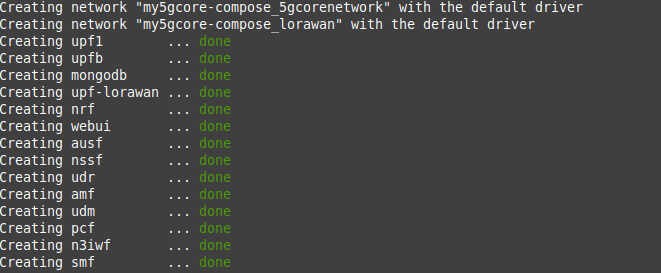 
</p>

Test my5Gcore containers. In this test all containers status should be up.
 
```bash
$ sudo docker-compose ps
```

<p align="center">
    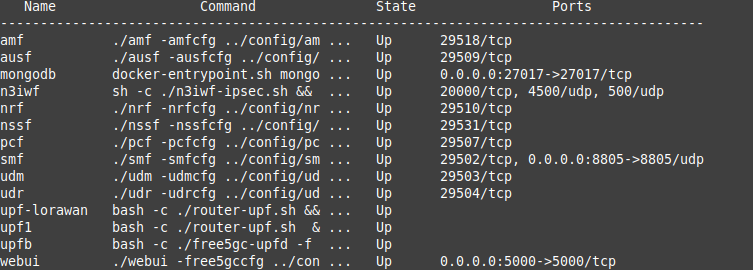 
</p>


The next step of the experiment is to store in UDR the UE's information using the Web Interface that is available at http://localhost:5000, as is shown in the image below.


```bash
  Subscriber information: 
  supi: 2089300007487
  k: 5122250214c33e723a5dd523fc145fc0
  Op: c9e8763286b5b9ffbdf56e1297d0887b
```
 

<p align="center">
     
    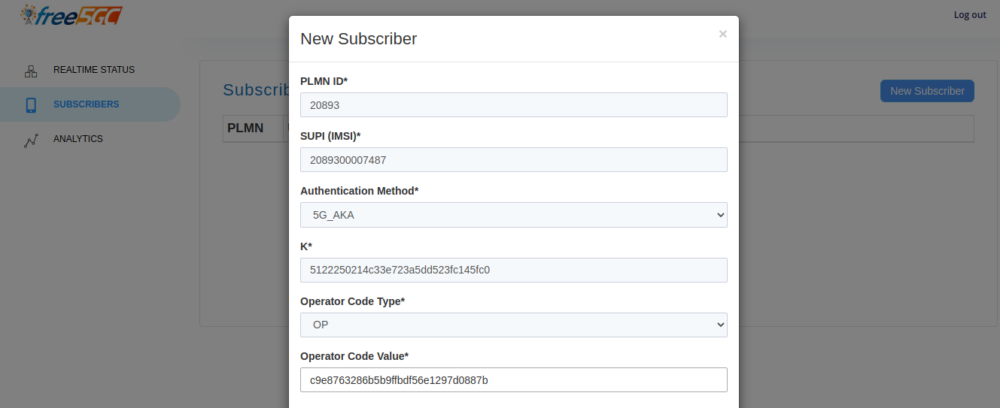 
</p>


#### Next run and configure LoRaWAN network

To build and run the lorawan network containers, use the following commands:

```bash
$ cd ~
$ cd SBrT2020-Minicurso1/docs/non3gpp-iot-use-case/lorawan-docker/
$ docker-compose build
$ sudo docker-compose up -d
```

<p align="center">
    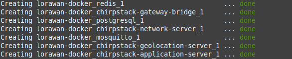 
</p>

Test  LoRaWAN network containers.In this test all containers status should be up.

```bash
$ sudo docker-compose ps
```

<p align="center">
    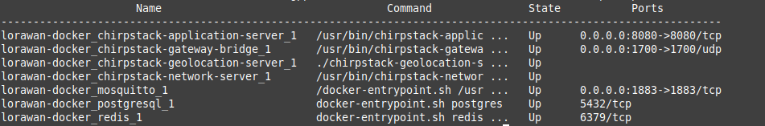 
</p>

#### LoRaWAN network profile configuration

After run lorawan docker-compose, to add the LoRa gateway to the ChirpStack Server network. For this, access the ChirpStack Application Server web-interface 
(http://localhost:8080) and add the gateway with the following steps.

<p align="center">
    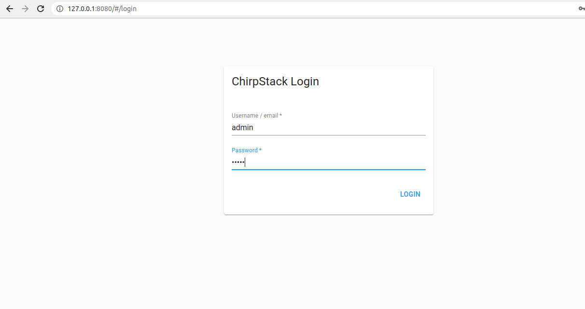 
</p>

To connect the ChirpStack Application Server instance with the ChirpStack Network Server instance, 
click Network servers and after click in Add.

<p align="center">
     
</p>

To create a service profile.

<p align="center">
    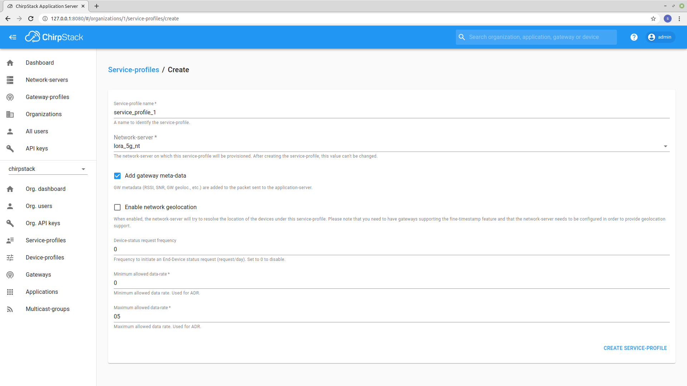 
</p>

To configure the Gateway Profile.

<p align="center">
    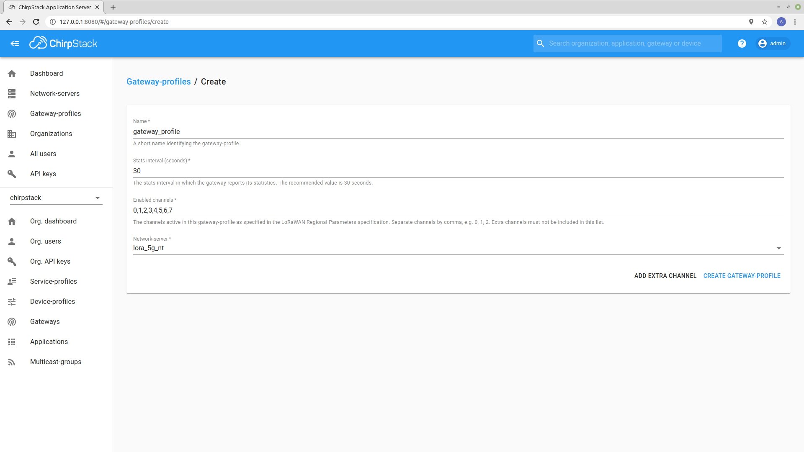 
</p>

To add the gateway ID that will be managed, after adding the Service Profile and Gateway Profile.

<p align="center">
    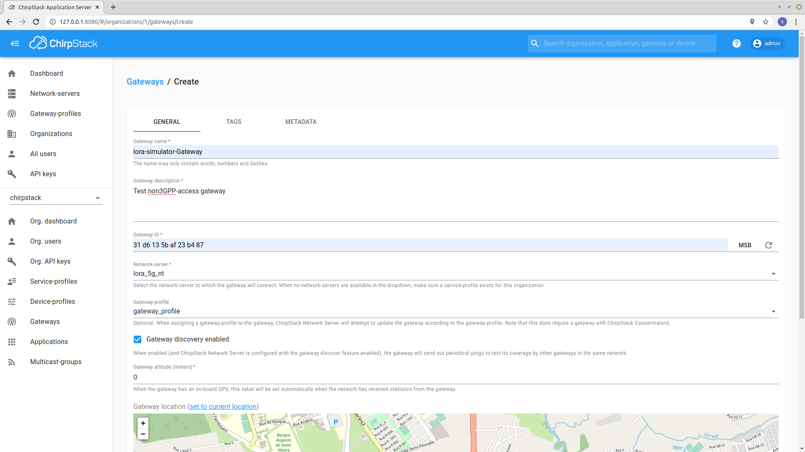 
</p>

The LoRaWAN gateway must be functional if the following information appears.

<p align="center">
    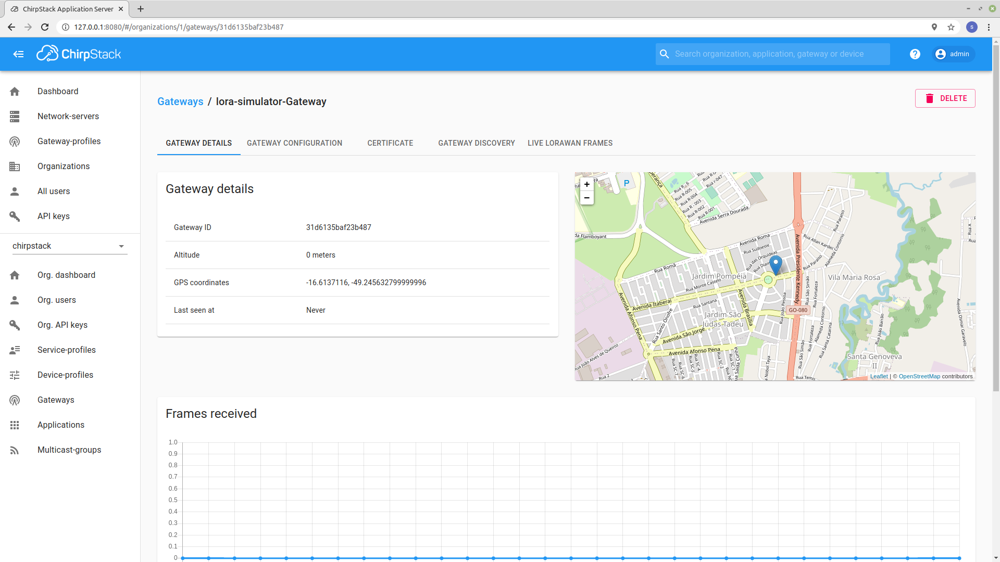 
</p>

To configure the sensors that we want to monitor, add a profile for the device.

<p align="center">
    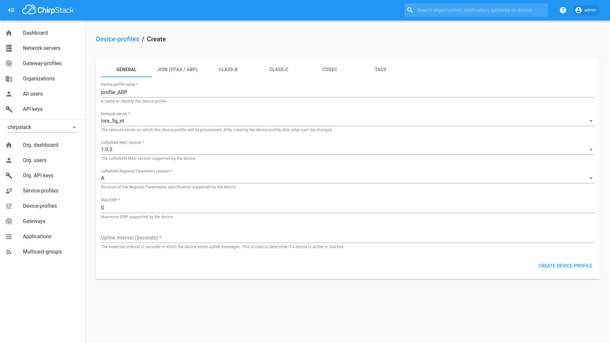 
</p>

The device must be associated with an application, so we must create it.

<p align="center">
    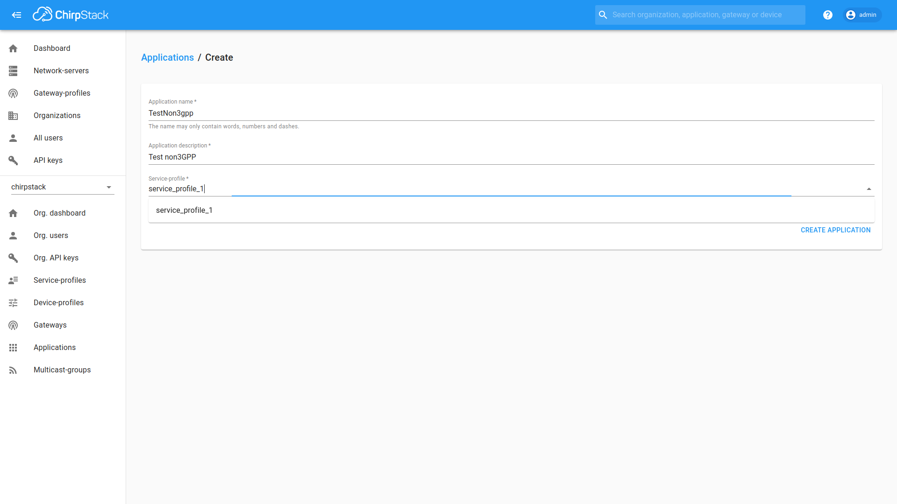 
</p>

We can add the device to the application.

<p align="center">
    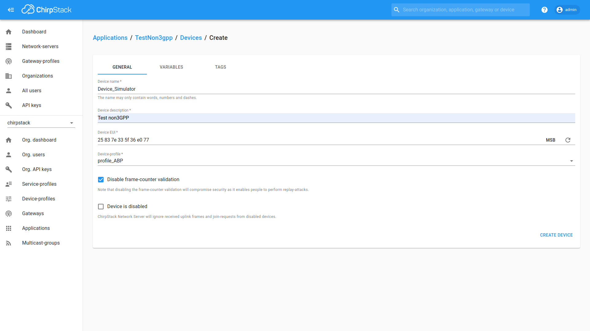 
</p>

We need to configure the corresponding hardware device address.
<p align="center">
    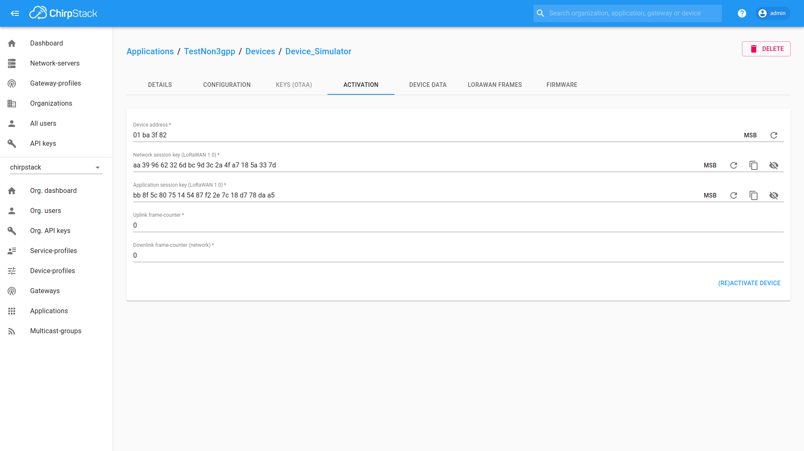 
</p>

#### Next run and configure non-3GPP LoRa IoT network

To build and run the lora iot network containers, use the following commands:

```bash
$ cd ~
$ cd SBrT2020-Minicurso1/docs/non3gpp-iot-use-case/lorawan-iot/
$ docker-compose build
$ sudo docker-compose up -d
```

<p align="center">
     
</p>

Test  LoRa iot network containers. In this test all containers status should be up.

```bash
$ sudo docker-compose ps
```
<p align="center">
     
</p>

## Troubleshooting
Sometimes, you need to drop data from DB.
```bash
$ docker exec -it mongodb mongo
> use free5gc
> db.subscribers.drop()
> exit # (Or Ctrl-D)
```

Another way to drop DB data is just remove db data. Outside your container, run:
```bash
$ cd ~/SBrT2020-Minicurso1/docs/non3gpp-iot-use-case/my5Gcore-compose/
$ sudo docker-compose down
$ sudo rm -rf ./dbdata
```

